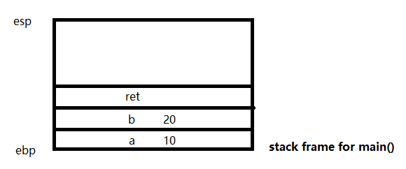
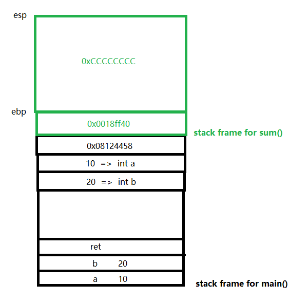
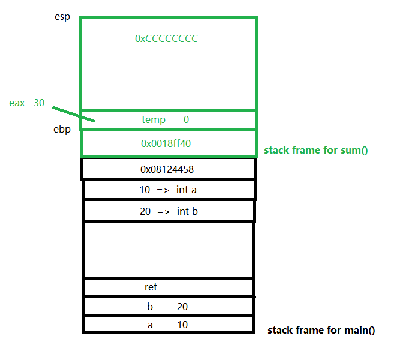
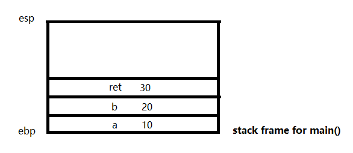

# Function Call: Stack Frame

Let's look at the following code:

``` c++
int sum(int a, int b) {
	int temp = 0;
    temp = a + b;
    return temp;
}

int main() {
    int a = 10;
    int b = 20;
    int ret = sum(a, b);
    cout << "result: " << res << endl;
    return 0;
}
```

It is a simple program, but what exactly happened when the program is running? You may have two questions:

1. After main() called sum(), how does the program know which function to return back to?

2. After sum() returns to main(), how does the program know which line to continue?  

Now let's  start from assembly language to see what happens in the black box.

### Stack Frame

Every time a function is called, an independent stack frame is created on the stack. We use two registers, ***ebp*** and ***esp*** to determine the scope. ebp points to the bottom of the stack, while esp always points to the top of the stack.

In the program above, we first assign values to integers *a* and *b*. Each integer is 4 bytes in size, so we push them into the stack with

```assembly
mov dword ptr[ebp-4], 0Ah
mov dword ptr[ebp-8], 14h
```

Then we meet the next commands. We assign the return value of sum() to variable *ret*. How does that happen?



### Function Call

After a function is called, we first push all the arguments into the stack. In C and C++, the push order is from right to left, so we push *b* and *a* in order.

```assembly
mov eax, dword ptr[ebp-8]
push eax
mov eax, dword ptr[ebp-4]
push eax
```


Then we need push the address of the next command into stack, the call command does so. This ensures that we can find our way to continue after we return from the function.

```assembly
call sum	
add esp, 8	# Next command 0x08124458
```


Now we enter sum(). Remember that stack frame is independent for each function, so we need to adjust it. First, we push the address of caller's *ebp* into the stack, so that we can restore it after. Then, we set *ebp* to *esp*, which means that the new stack frame is on the top of the older one. Finally, we need to assign memory space for the new stack frame. In Visual Studio, the compiler will automatically assign an value *0xCCCCCCCC* to it, while not in g++ or gcc.

```assembly
push ebp	# 0x0018ff40
mov ebp, esp
sub esp, 4Ch
```



Then inside sum(), we calculate the sum of *a* and *b*, and store the result into *temp*.

```assembly
mov dword ptr[ebp-4], 0
mov eax, dword ptr[ebp+0Ch]
add eax, dword ptr[ebp+8]
mov dword ptr[ebp-4], eax
```



### Function Return

When we return from a function, we also need to return its stack frame back to the system. If a function has a return value, it first store the value inside register *eax*. Then it recycle the local variable space by move *esp* to the bottom. By popping the old address out, we restore *ebp* to the bottom of the caller function.

```assembly
mov eax, dword ptr[ebp-4]
mov esp, ebp
pop ebp
```


Now we want to go back to where we called the function. *ret* command pop the current element on top of the stack, and put it inside a PC register. PC register always store the address of the next command for the CPU to execute, so we are able to jump to the position we store before.

```assembly
ret
```


After that, the function parameters are no longer useful, we can simply pop them out. Then we assign the return value from *eax* to *ret*.

```assembly
add esp, 8
mov dword ptr[ebp-0Ch], eax # assign return value
```

Now the stack frame remains the same as initially. All memories related to the called function has been eliminated.



### At Last 

This is all about the underlying principle of function call and return. Now we are able to answer these two questions at the beginning. You may also figure out what's the problem in the following code, and how to avoid this in your own codes.

```c++
int* foo() {
    int data = 10;
    return &data;
}

int bar() {
    int *p = foo();
    cout << *p << endl;
}
```

